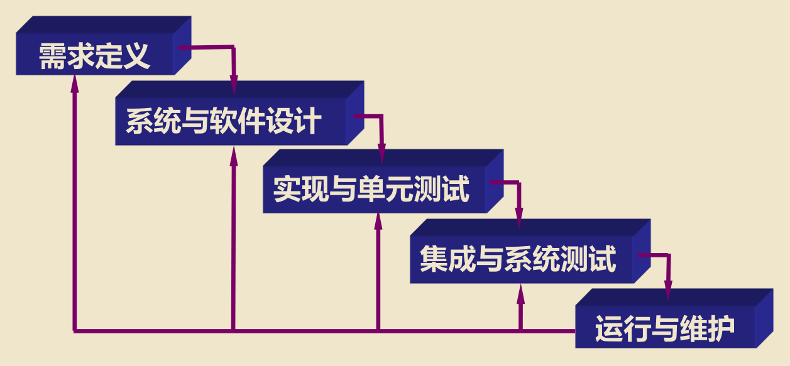
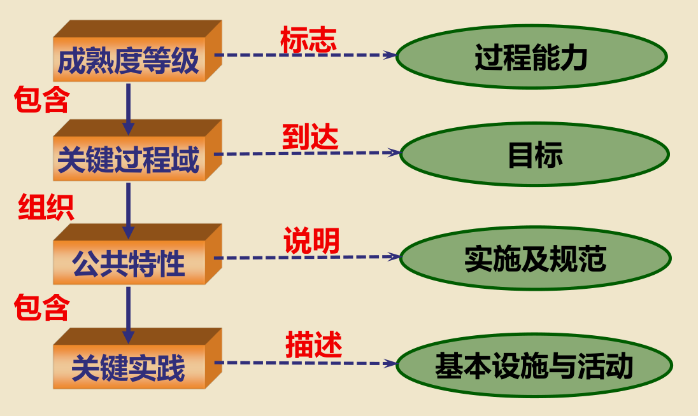
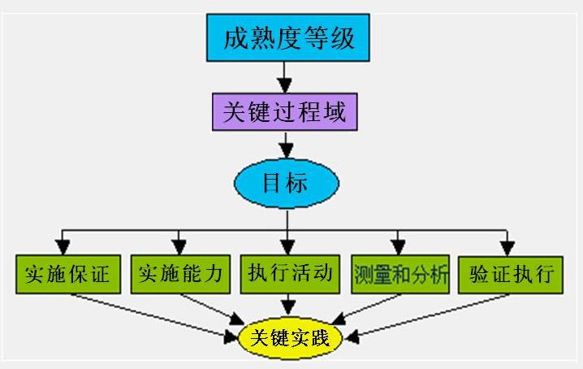
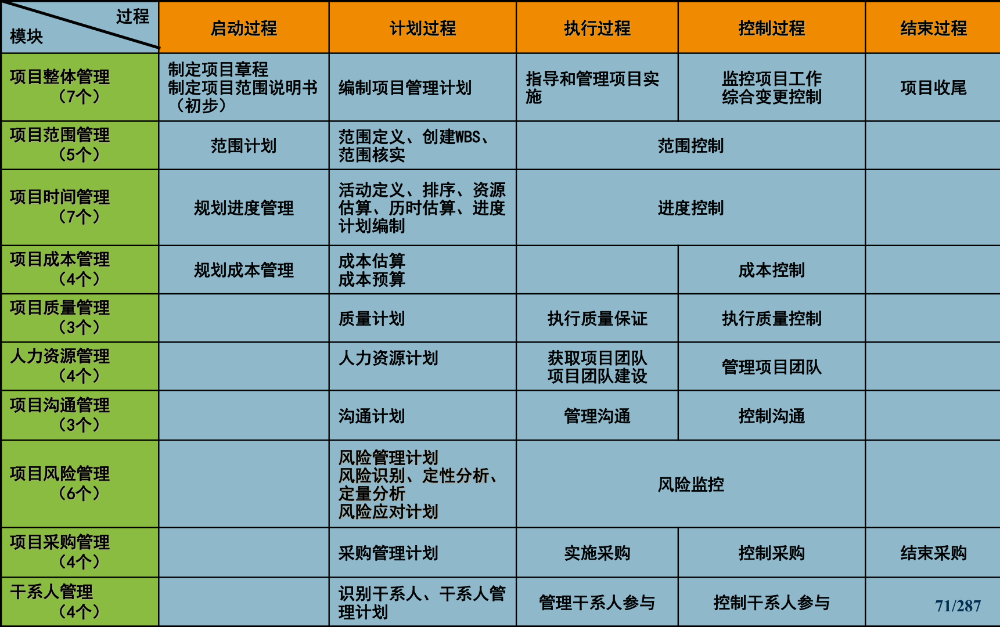
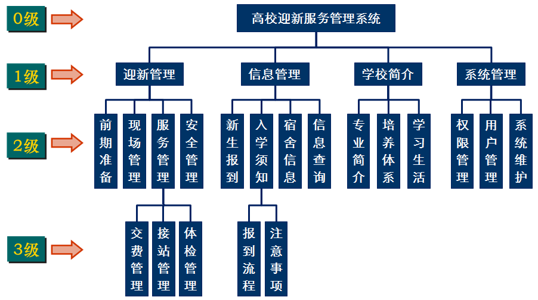

# 软件开发过程与项目管理

- 为什么要学习软件开发过程管理

    - 软件（系统）开发有难度、很复杂
    - 过程质量影响结果质量，影响成本

- 为什么要学习项目管理

    - 软件开发、软件应用实施皆为项目
    - 企业发展、社会进步缘于项目推进
    - 项目的成功需要管理方法

## 软件开发过程管理

- 软件开发过程管理主要学习内容

    1. 软件定义
    2. 软件的特点
    3. 软件的分类
    4. 软件产品的组成
    5. 软件开发项目组
    6. 软件开发过程
    7. 软件开发过程模型
    8. 软件开发过程与软件测试

### 软件定义

软件即服务

- 20世纪50年代：软件 = 程序

    面向过程的程序 = 算法 + 数据结构

- 20世纪60年代：软件 = 程序 + 文档

- 20世纪70年代：软件 = 程序 + 文档 + 数据

    面向对象的程序 = 对象 + 消息

    面向构件的程序 = 构件 + 构架

### 软件的特点

- 软件是一种逻辑实体
- 开发过程中没有明显的制造过程
- 软件是知识与智慧型产品
- 软件不会磨损，维护相对困难

### 软件开发项目组

#### 为什么要建立项目组？

- 为软件开发临时成立的项目组
- 根据软件开发复杂程度不同，项目组人员多少存在区别，但分工相似

#### 软件开发需要哪些人员？

- 项目经理或组长
- 系统分析师/设计师
- 软件开发工程师
- 软件测试员/测试师
- 技术协作
    - 美工
    - 手册编写
    - 文档

### 软件开发过程

- **软件开发过程**：是指软件开发人员用于软件开发、软件维护以及软件相关产品（包括项目计划、设计文档、代码、测试用例和用户手册）的一系列的活动、方法、实践和创新

- **软件生命周期**：软件从**需求确定**、**设计**、**开发**、**测试**直至**投入使用**，并在使用中**不断地修改、增补和完善**，直至**被新系统替代而停止该软件使用**的全过程

    包含的阶段：

    - 可行性研究
    - 需求分析和定义
    - 总体设计/概要设计
    - 详细设计
    - 编码实现
    - 软件测试、运行和维护

- 软件开发过程按照如下**顺序**进行：

    1. 需求：得到软件**需求规格**说明书
        - 信息描述
        - 功能描述
        - 行为描述
        - 其它需求
    2. 设计：得到软件**设计规格**说明书
        - 概要设计
        - 详细设计
        - 接口设计
        - 数据库设计
    5. 编码

#### 需求分析

- 根据客户的要求，了解、掌握客户需求中的产品功能、特性、性能、界面和具体规格等，然后进行分析，确定软件产品需要实现的目标
    - **做什么**（不是怎么做）
    - **做到什么程度**（**量化**）
- 需求层次
    - **业务需求**：**组织或客户**的**总体要求**，重点在于描述**为什么要开发这个系统**，**要达到什么样的目标**
    - **用户需求**：**具体用户**的**要求**，用户要求系统能完成的任务，**即用户能使用这个系统做什么**（对应功能）
    - **功能需求**：**规定**系统要实现的**功能**，用户利用这些功能完成工作，满足业务需求，**描述开发人员要实现什么**
    - **非功能需求**：主要指**系统需求**，包括系统应达到的**性能、可靠性、安全性、易用性等**，**侧重于系统的质量**属性

#### 设计

- 基于需求分析结果，对软件的业务逻辑、功能及实现方法等进行设计，**一般分为概要设计和详细设计**，**主要包括流程设计、数据结构设计、软件体系结构设计、应用接口设计、模块设计、界面设计等**

##### 概要设计

- 含义
    - 软件需求分析阶段要研究“**做什么**”，并通过说明书描述出来，建立系统的**逻辑模型**
    - **设计阶段**要把软件“做什么”变成“**怎么做**”，建立系统的**物理模型**
    - 把软件需求转换为软件表示时，首先要描述**软件的总体体系结构**，即为概要设计，它是详细设计的大纲
- 任务与步骤
    - 设计系统方案，确定大致的**功能模块数据库设计**
    - 模块功能分解描述-流程图
    - 页面结构的设计
    - 编写概要设计文档等等

##### 详细设计

在具体进行程序**编码之前**，根据概要设计文档

- **分解、细化已划分出的每个功能模块**
- **确定具体的算法，并清晰、准确的描述**，包括数据库表的设计等
- 设计成果可用
    - 程序流程图描述
    - 也可用伪码描述
    - 也可以用形式化软件设计语言描述

详细设计的结果质量基本决定了最终程序代码的质量。

#### 编程实现

将设计转换成计算机可读的程序或代码

#### 测试

对设计、编程进行验证和用户需求确认的过程

- 黑盒测试
- 白盒测试

#### 发布、使用与维护

维持软件运行，修改软件缺陷、增强已有功能、增加新功能、升级等

### 软件开发过程模型

软件开发模型（`Software Development Model`）指**软件开发全部过程、活动和任务的结构框架**。能清晰、直观地表达软件开发全过程，明确规定了**要完成的主要活动和任务**，包括需求、设计、编码和测试等阶段，有时也包括维护阶段。 （强调开发方法、思路）

#### 典型模型

- 瀑布模型
- 原型模型
- 快速应用开发（RAD）模型
- 增量模型
- 螺旋模型
- 喷泉模型

#### 瀑布模型

瀑布模型**线性过程太理想化**，已不再适合现代软件开发模式，**主要问题**在于：

- **各个阶段的划分完全固定**，阶段之间产生大量的文档，极大地增加了工作量
- 由于开发模型是**线性的**，用户只有等到整个过程末期才能见到开发成果，增加了开发的风险
- **早期的错误可能要等到开发后期的测试阶段才能发现**，进而带来严重的后果

#### 改进的瀑布模型

相比瀑布模型在各阶段添加了反馈路径，不再是线性的，含有**反馈环**

#### 快速原型模型

- 特点
    - 在需求定义之前，需要快速构建一个系统
    - 根据构建系统的优缺点，用户给开发人员提出反馈意见
    - 根据反馈意见修改软件需求规格，以便系统可以更正确地反映用户的需求
    - 减少各种假设以及风险
- 关键点
    - 通常情况下，很难在初始阶段就获得明确、完整的需求说明，因此在**获得一组基本需求说明后，快速实现一个原型**，满足用户基本要求
    - 使**用户**在试用过程中**受到启发**，**进一步补充和完善需求**
    - 用户与开发者在试用原型过程中**加强通信与反馈**
    - 通过**反复评价和改进原型**，减少误解，弥补漏洞，适应变化，最终提高产品开发的质量

#### 螺旋模型

- 螺旋模型（`Spiral Model`）**将瀑布模型和快速原型结合起来**，**强调**了其他模型所忽视的**风险分析**，特别**适合于大型复杂的系统**。螺旋模型沿着螺线旋转，**自内向外每旋转一圈便开发出更完善的一个新版本**
- 螺旋模型 = 瀑布模型 + 快速原型 + **风险分析**
- 通常包含以下四方面工作
    - 制定计划：确定软件目标，选定实施方案，**弄清项目开发的限制条件**
    - **风险分析**：分析所选方案，**考虑如何识别和消除风险**
    - 实施工程：实施软件开发
    - 客户评估：评价开发，提出修正建议，进入下一阶段

### 软件开发过程与软件测试的关系

- 软件开发过程包含了：
    - 单元测试
    - 综合测试
    - 确认测试
- 测试的问题
    - 测试什么
    - 如何测试
    - 何时测试
    - 谁来测试
- 软件测试就是**产品质量测试**

### 软件开发过程管理

#### 关于过程管理

- 从大量项目实践中归纳总结出的行之有效的过程称为**最佳实践(`Best Practices`)**
- 软件过程管理就是在软件开发过程中，**对最佳实践进行有效的积累**，形成可重复的软件过程，**并使最佳实践在组织范围内共享**
- 软件过程管理可以将个人能力转变为企业的能力

#### 主要内容

- 过程定义：对最佳实践进行总结，形成一套稳定的、**可重复的软件过程**
- 过程改进：发现软件生产过程中对产品质量产生影响的问题，**对软件过程中的偏差和不足进行不断优化，提高软件过程能力**

## 软件质量管理

### 引入

#### 质量的含义

- 国际标准化组织ISO对质量的定义：反映实体满足明确和隐含需要的能力的特性总和
- 质量应该包括准确性，稳定性，可靠性，安全性，适用性，可拓展性等

#### 质量管理的含义

- 在质量方面的指挥和控制组织的协调活动

    Coordinated activities to direct and control an orgnanization with regard to quality ——`ISO9000:2000`

- 质量管理通常包括

    - 制定质量方针
    - 质量目标
    - 质量策划
    - 质量控制
    - 质量保证
    - 质量改进

- 质量管理是组织为**使产品质量能满足不断更新的质量要求、达到顾客要求而开展的所有相关管理活动的总和**，包括但不限于如下活动：

    - 策划
    - 组织
    - 实施
    - 控制
    - 保证
    - 检查
    - 审核
    - 改进

#### 质量管理发展的过程

- 1900：手工操作者
- 1920：专职检验员
- 1931：过程统计技术
- 1960：全面质量管理
- 2000：以顾客为中心

#### 现代质量管理的发展

- **质量检验阶段**：美国泰勒为代表的“科学管理运动”，**主张事后检验把关**
- **统计质量控制阶段**：休哈特将**数理统计的原理**运用到质量管理中来，并**发明了控制图**，**主张检验加预防**
- **全面质量管理阶段**：费根堡姆提出全面质量管理的观点，**认为不仅限于数理统计，需要全面运用各种管理技术和方法**
- 一些现代质量管理的标准：
  - ISO9000族质量管理标准
  - 美国波多里奇奖
  - 欧洲质量奖
  - 日本戴明奖等各种质量奖
  - 卓越绩效模式
  - 六西格玛管理等

#### 软件质量管理的含义

**满足顾客和最终用户需要和期望的过程**，可以遵循如下要点实现（SW-CMM [CMU/SEI-93-TR-025]）：

- 确定一个软件产品的质量目标
- 建立实现这些目标的计划
- 监督和调整软件计划、软件工作产品、活动和质量目标

#### 软件质量的概念

- 软件质量是软件产品**满足使用要求的程度**
- 高质量软件系统的衡量标准
    - 能够**准时地交付给用户**
    - 所耗费的**成本不超出预算**
    - 并且最重要的是，**能够正常地运行**，“正常地运行”意味着该软件必须尽可能没有缺陷(bug)

#### 软件质量保证

软件质量保证，`Software Quality Assurance, SQA`

- SQA是通过建立一套有计划，系统的方法，向管理层保证拟定出的标准、步骤、实践和方法能够正确地被所有开发工作所采用。它通过对软件产品和活动进行评审和审计来验证软件是否符合标准。
- 质量保证是**一个活动**，它向所有有关的人提供证据以确立质量功能正在按需求运行的信心
- 软件质量保证是**一系列系统性的活动**，它提供开发出满足使用要求产品的软件过程的能力证据

### ISO9000标准

#### ISO知识

- `ISO`是一个国际标准化组织，建立于1947年，与`IEC`（国际电工委员会）有密切的联系
- 代表中国参加ISO和IEC的是中国国家技术监督局`CSBTS`
- ISO和IEC都是非政府机构，它们作为一个整体担负着制订全球协商一致的国际标准的任务
- ISO的宗旨是在全世界范围内促进标准化工作及相关活动的发展，以便于国际物资和服务的交流，并扩大在知识、科学、技术和经济方面的合作

#### ISO9000质量标准思想

- **控制思想**：即**对产品形成的全过程进行控制**。任何事物都是由一个或多个过程活动的结果，只要对产品形成的全过程进行控制并达到过程质量要求，最终产品的质量就有了保证
- **预防的思想**：通过**对产品形成的全过程进行控制，建立有效的自我完善机制**，防止不合格品，从根本上减少或消除不合格品

### 能力成熟度模型CMM

#### 软件能力成熟度

- 软件能力成熟度模型，`Capability Maturity Model For Software, SW-CMM`

- 由美国卡内基梅隆大学软件工程研究所(`CMU/SEI`)研究出的一种**用于评价软件承包商能力**并**帮助改善软件质量**的方法

- 目的是

    - 帮助软件企业对软件工程过程进行管理和改进
    - 增强开发与改进的能力

    从而能够按时、不超预算地开发出高质量的软件

#### CMM/CMMI实施带来哪些效果

- 改进软件产品的质量
- 改进项目满足预定目标的能力
- 减少开发成本和周期
- 降低项目风险
- 更有效地控制供应商
- 提高组织过程能力
- 提高竞争力，市场占有率，效益
- 等等

#### CMM结构图

- 除初始级别以外，CMM的每一级包含了实现这一级目标的若干关键过程域（`KPA，Key Process Areas`）
- KPA目标，表示每一个KPA的范围、边界和意图
- 每个KPA包含五个公共特性
- 关键实践（`KP，Key Practice`）由若干个KP（Key Process）组成，通过实现这些KP达到KPA目标。KP会描述应该“做什么”，但不规定“如何”去达到这些目标。具体的操作方法和步骤由项目组织自己确定

##### 软件能力成熟度等级

1. **初始级**：软件过程无秩序，有时甚至是混乱的。软件过程定义没有章法和步骤可循，**软件产品的成功往往依赖个别人的努力及机遇**
2. **可重复级**：**建立了基本的项目管理过程**，可用于对成本、进度和功能特性进行跟踪。对类似的项目有章可循并能重复以往的经验
3. **已定义级**：用于管理的、工程的软件过程均已实现文档化、标准化，**形成了软件组织的标准软件过程**
4. **管理级**：软件过程和产品质量**有详细的度量标准，并得到了定量的论证和控制**
5. **优化级**：**持续的进行过程改进**。过程改进可控，技术改进能够被**量化**、评估，进行必要的技术改进和优化

##### 关键过程域

注：非空单元格与其下到下一个非空单元格之间的所有空白单元格构成一个合并单元格

| 等级     | 关键过程域         | 过程分类 | 特征                                                       |
| -------- | ------------------ | -------- | ---------------------------------------------------------- |
| 优化级   | 缺陷预防           | 工程问题 | 过程能力可控、可改进，并且可以以量化方式来评估改进         |
|          | 技术变更管理       | 组织问题 |                                                            |
|          | 过程变更管理       |          |                                                            |
| 管理级   | 量化过程管理       | 管理问题 | 过程能力量化，根据量化来预测和控制一个项目的过程绩效       |
|          | 软件质量管理       | 工程问题 |                                                            |
| 已定义级 | 软件机构过程关注点 | 组织问题 | 有定义好的属于组织范围的过程，按照过程有效的进行开发       |
|          | 组织过程定义       |          |                                                            |
|          | 培训计划           |          |                                                            |
|          | 集成软件管理       | 管理问题 |                                                            |
|          | 组建合作           |          |                                                            |
|          | 软件产品工程       | 工程问题 |                                                            |
|          | 同行评审           |          |                                                            |
| 可重复级 | 需求管理           | 管理问题 | 不存在组织范围的过程，利用已存在的项目管理实践和经验来开发 |
|          | 软件项目计划       |          |                                                            |
|          | 软件项目跟踪及监督 |          |                                                            |
|          | 软件质量保证       |          |                                                            |
|          | 软件配置管理       |          |                                                            |
|          | 软件子合同管理     |          |                                                            |
| 初始级   | 无                 |          | 以个人主观认为合适的方式来开发                             |

##### 五个公共特性

**每个KPA包含五个公共特性**

1. **实施保证**：企业为了建立和实施相应的KPA所必须采取的活动，这些活动包括制定企业范围的政策和确定高层管理的责任
2. **实施能力**：企业实施KPA的前提条件。包括资源保证、人员培训等内容。企业必须采取措施满足这些条件后，才可能执行KPA活动
3. **执行活动**：描述了执行KPA所需要的必要角色和步骤。执行活动一般包括计划、执行的任务、任务执行的跟踪等
4. **度量分析**：描述了执行过程的度量和度量分析要求。典型的度量分析的要求是确定执行活动的状态和执行活动的有效性
5. **实施验证**：验证执行活动是否与所建立的过程一致，涉及到管理方面的评审和审计以及质量保证活动

#### ISO9000与CMM的关系

- 都是为了解决**质量和过程管理**方面的问题
- ISO9001聚焦于**供应商和用户间的关系**，CMM模型强调持续过程改进，关注**软件的开发过程**
- ISO9001**适用于各类组织**，CMM**只用于软件行业**
- ISO9000只有**通过与不通过两个结论**，CMM具有**五个评估等级**
- ISO9000**不涉及预算、项目周期管理等内容**，CMM有所覆盖
- ISO9000相当于CMM2级和3级的部分内容

### 能力成熟度集成CMMI

CMMI是为了解决原有不同CMM模型的重复性、复杂性，并减少由此引起的成本增加、缩短改进过程时间而提出。

#### CMMI成熟度等级及特点

1. 初始级：不规范的过程。目标清晰，但任务的完成具有很大的偶然性
2. 已管理级：有纪律的过程。能够遵守既定的计划与流程，排除了完成任务的随机性
3. 已定义级：标准一致的过程。将项目实施的管理体系与流程制度化
4. 量化管理级：可预见的过程。数字化的管理
5. 优化管理级：不断改进的过程。预防次品的出现，能够主动改善流程

#### PSP/TSP与CMMI

- CMU-SEI在CMM1.1基础上提出了：

    - PSP：个人软件过程
    - TSP：团队软件过程

- PSP和TSP是

    - 使个人和团队的工作优化及规范化
    - 通过让个人和团队使用预定义的标准流程建立可测量的目标，跟踪目标的完成情况
    - 从而提高质量

    与CMMI相结合，从而：

    - 构建高绩效的团队
    - 优化整个组织
    
    的**流程**（不知道这样理解对不）
    
- PSP、TSP 和CMMI为软件产业提供了一个集成化的、三维的软件过程改革框架

    - PSP注重个人技能
    - TSP注重团队的高效工作和产品交付能力
    - CMMI注重组织能力和成熟度的提高

## 项目管理

### 简介

#### 项目管理基本概念

##### 什么是项目

- 美国项目管理学会（PMI)定义：A temporary endeavor undertaken to create a unique product, service, or result.
- 翻译1：项目是为了实现一个独特的目的而进行的临时性任务
- 翻译2：项目是一种被承办的旨在创造某种独特产品或服务的一次性努力

##### 项目的特点

- 目标性：有特定目标，以目的作为存在的必要
- 临时性：**一次性**，有明确的开始、结束时间
- 独特性：每一个项目都是唯一的
- 约束性：每一个项目的资源、成本和时间都是有限的
- 不确定性：存在各种因素的不确定性或项目风险
- 有发起人：要有一个主要发起人或客户（利益相关者）

##### 项目与日常活动的区别

- **项目是一次性的**，日常活动是重复进行的
- **项目以目标为导向**，日常活动通过效率和有效性体现
- **项目通过项目和管理完成**，日常活动通过**职能管理**完成
- **项目存在变更管理**，日常活动是持续性的

##### 什么是项目管理

在项目活动中运用专门的知识、技能、工具和技术，使项目能够实现或超过项目利益相关者的需要和期望

##### 项目管理的关键要素

- **需求和目标**是项目实施的**基本要求**
- **资源**是项目实施的**根本保证**
- **项目组织**是项目实施运作的**核心实体**
- **环境**是项目成功的**可靠基础**

##### 国际项目管理学术组织

国际项目管理学术组织的出现标志着项目管理走向科学

- 国际项目管理协会IPMA，1965年
- 美国项目管理学会PMI，1969年

##### 项目出现问题的主要原因

1995年斯坦迪咨询集团研究报告

- 组织方面出现问题
- 需求分析不准确、不全面
- 缺乏系统的计划和控制
- 预算存在差异

#### 项目管理知识体系

##### 五个标准化过程

1. **项目启动**：确定项目目标、范围，制定项目章程、任命项目经理，项目可行性研究与分析，包括经济性、风险性等
2. **项目计划**：明确项目目标、分解项目目标，确定项目方案，制定完成项目的工作计划
3. **项目执行**：项目执行即项目的实施，是协调人员、资源具体执行项目计划的过程，包括项目的详细设计与实施
4. **项目控制**：项目管理的过程控制，通过定期监控和评估项目进度，确保项目的有序进行和目标的实现
5. **项目收尾**：项目收尾过程是对项目完成后结果的验收，确认是否达到项目目标，形成完整的项目验收文档

##### 十大知识领域

- 综合管理
- 范围管理
- 时间管理
- 成本管理
- 质量管理
- 人员管理
- 沟通管理
- 风险管理
- 采购管理
- 干系人管理

4大核心知识领域

- 范围
- 时间
- 成本
- 质量

##### 47个模块（子过程）

#### 现代项目管理

##### 现代项目管理的三大特点

- 由**阶段性管理**转化为**全过程管理**
- 由**经验管理**转化为**科学管理**
- 由**微观管理**发展为**宏观管理**

##### 现代项目管理的发展趋势

- 全球化
- 多元化
- 专业化

#### 软件项目管理的特殊性

##### 软件项目及其分类

- 定义：以软件开发、实施为主要目的的项目
- 分类
    - 通用软件产品开发项目
    - 定制软件系统开发项目
    - 软件实施项目
    - 软件服务项目

##### 软件项目的特点

- 生产无形（抽象的产品)
- 需求具有不确定性或易更改
- 结果难于进行完整的测试
- 大都是“一次性”的人力消耗型项目
- 需要利益相关者的协作完成
- “一把手”工程
- 商业模式的特殊性

##### 软件项目管理

- 定义：根据项目管理理论，结合软件产品开发实际，运用相关知识、技能、工具和技术，以满足软件需求方要求（保证项目成功）的管理实践
- 信息化建设是提高企业核心竞争力的重要手段
- 软件项目管理是决定软件项目实施能否成功的重要因素
- 项目管理是公认的企业管理的核心竞争力之一

### 项目综合管理

- 项目综合管理的进行需要依赖其它九个管理职能（也就是十大知识领域中的另外九个）
- 项目综合管理贯穿于整个项目生命期

#### 项目阶段

- 为完成一个项目，通常要将项目分成**若干个项目阶段**，以便提供更好的管理控制
- 项目划分的阶段应该有**明确目标**，有**结束标志**
- 每个项目阶段以**一个或几个可交付成果**的完成作为标志
- 项目各个阶段的收尾或结束可以用来确定以下工作
    - 项目是否应当进入下一阶段
    - 项目是否进行了有效地费用控制等

#### 项目组织

- 组织作动词，就是把多个人联系起来，做一个人无法做的事
- 组织作名词，指包括与它要做的事相关的人和资源，及其相互关系

#### 项目经理应具备的基本素质

- 深厚的项目管理工作经验，丰富的项目管理知识
- 熟悉项目管理业务，具备较强的技术能力
- 组织和领导项目团队的能力
- 能及时判断项目实施过程中存在及出现的问题，并提出办法解决问题
- 能及时预测项目实施过程中潜在的问题，并提出预防措施
- 能够科学地计划和利用自己的时间，有表率作用
- 善于沟通与客户的关系，并能处理和协调好与用户、分包商之间的问题
- 充分了解项目团队中每个岗位的职责和分工
- 善于激励他人、调动项目成员，发挥项目成员的能力
- 能够培养项目成员

### 项目范围管理

#### 项目范围的含义

- 项目范围包括项目的最终产品或者服务，以及实现该产品或者服务所需要完成的全部工作，其中：
    - 产品范围界定为“产品或服务所包含的特征或功能”
    - 工作范围界定为“为交付具有规定特征和功能的产品或服务所必须完成的工作”

#### 项目范围管理

- 定义：对项目包括什么和不包括什么的定义与控制的过程
- 用于确保项目团队和项目利益相关者对作为项目结果的项目产品以及生产这些产品所用到的过程，**有一个共同的理解**

#### 项目范围管理的主要过程

- 项目启动
- 范围计划
- 范围界定
- 范围核实
- 范围变更控制

##### 项目启动

- 识别潜在的项目
    - 根据企业战略规划提出
    - 根据市场需求提出
    - 根据企业管理发展要求提出等
- 选择及确定项目
    - 考虑经济效益（效益是否是第一因素）
    - 考虑政治因素

##### 范围计划

- **范围计划编制**是创立书面文件、阐述项目范围并为项目确定基础条件的过程，包括了用以确定项目或阶段是否成功完成的标准
- **范围说明书**的意义是通过确认项目目标和主要项目的子项目，使项目团队与项目客户之间达成统一的协议

##### 范围界定

- 主要工作是逐级分解项目任务，使其变成更小、更易管理的单元
- 目的在于提高估算成本时间和资源的准确性，为绩效测量和控制确定一个基准线，使工作变得更易操作，责任分工更加明确
- 正确的范围界定是项目成功的关键之一

###### 工作分解结构WBS

- 是一种**以结果为导向的分析方法**，用于分析项目所涉及的工作，所有这些分解的工作构成项目的整体范围
- WBS分解方式：分解的基本单元应该是有形的、可核查的（时间、成本）
    - 按结构分解
    - 按功能分解
    - 按过程分解
    - 按目标分解

###### 按功能分解的一个实例

##### 范围核实

项目范围核实是**项目利益相关者正式接受项目范围的过程**，一般在项目生命周期的**各阶段结束时**发生，是项目收尾的一部分。范围核实不同于质量控制，它**关注工作结果的正确性**

##### 范围变更控制

- 范围控制主要是**管理范围的变更**，当项目范围有变更的时候需要对项目范围说明书、工作分解结构和范围基准等进行审核、确认及更新
- 范围控制的目的是确保项目的变化可及时响应、处理，包括及时的跟踪和有效的控制
- 范围控制不当容易造成项目不成功

### 项目时间管理

项目时间管理亦可理解为**项目进度管理**，是对项目执行过程中各项活动所需时间及能否按进度完成各项任务（里程碑）的控制管理。

#### 项目时间管理的意义

- 项目进度计划是项目最基本的控制工具
- 时间是最主要的成本依据
- 进度延误是项目管理的主要问题

#### 主要过程

PMBOK的项目时间管理过程

- 活动定义：范围管理的内容，也是时间管理中活动排序和历时估计的依据，因此作为时间管理启动步骤
- 活动排序：编制工期计划的基石
- 活动历时估计：编制工期计划的基石
- 制定进度计划：计算整个工期长度，确定起始及结束时间，设置阶段性里程碑，编制计划
- 进度计划控制：把进度计划与实施进程的偏差尽量控制在允许的范围内，必要时可进行调整，需要严格的计划变更程序

#### 项目工作活动的相互关系

- 工作之间的关系分为四种类型：

    - 结束到开始
        - 最为常用，典型的逻辑关系
    - 结束到结束
    - 开始到开始
    - 开始到结束
        - 极少使用

- 依赖类型？

    这里不知道课件上为什么会写后面三个依赖类型，这里猜测是四种关系的依赖类型

    - 强制依赖
    - 自由依赖
    - 外部依赖

#### 确定工作时间的主要方法

- 专家判断：依赖于历史的经验信息，也具有一定的不确定性和风险
- 类比估计：以类似的实际项目的工作时间来推测估计当前项目各工作的实际时间，可以认为是专家判断的一种表现形式

### 项目成本管理

#### 什么是成本

- 一般人认为成本就是需要多少费用，即为获得商品或服务而支付的货币量
- 会计人员将成本定义为：达到一个特定目标而牺牲或放弃的资源，资源不仅指货币

#### 软件项目成本的理解

- 完成软件项目相应付出的代价
- 待开发的软件项目需要的资金
- 人的劳动的消耗所需要的代价是软件产品的主要成本
- 开发成本是以一次性开发过程所花费的代价来计算的

#### 软件项目成本管理

即项目费用管理，是指为保障项目实际发生的成本不超过项目预算而开展的一系列管理活动，主要包括：

- 项目资源计划
- 项目成本估算
- 项目成本编制
- 项目成本控制

#### 项目成本为什么不可控制

- 项目**需求不确定**导致项目工期不确定、费用无法控制
- 项目采用的**技术先进，有风险**，可能导致费用无法控制
- 项目系统开发存在**个人行为**，人员的积极性、配合情况等有不可预测性，工作效率无法确定
- 项目具有**独特性**，缺少历史资料借鉴，成本估算带有一定程度的盲目性
- 受企业发展影响，项目的不可知性等

### 项目质量管理

#### 质量的定义

- 国际标准化组织ISO对质量的定义：反映实体满足主体明确和隐含需求的能力的特性总和
- 实体：指可单独描述和研究的事物，即**质量工作的对象**，如活动、过程、产品或组织等
- 明确需求：指在相关文档中已做出规定的需要
- 隐含需求：指用户和社会对实体的期望以及公认的、不必明确的需求

#### 影响软件质量的要素

- 准确性
- 稳定性
- 可靠性
- 安全性
- 适用性
- 可扩展性等

#### 软件质量的主体

- 设备：电脑、服务器、交换机等
- 网络：局域网、广域网、语音网等
- 系统：单机系统、网络系统、数据库等

#### 项目质量的含义

- 从项目作为一项最终产品来看，项目质量体现在**性能和使用价值**上，即项目的产品质量
- 从项目作为一次性的活动来看，项目质量由WBS反映出的项目范围内所有阶段、子项目、项目工作单元的质量所构成，即**项目的工作质量**
- **项目合同**是进行项目质量管理的**主要依据**

#### 项目质量的类型

- 产品质量
- 工作质量

工作质量是产品质量的保证

#### 影响质量的因素：4M1E

- 人-Man
- 机-Machine
- 料-Material
- 法-Method
- 环-Environment

#### 质量管理的成本

- 质量成本是
    - 为了保证和提高产品质量、满足用户需要而支出的费用
    - 以及因未达到质量标准而产生的一切损失费用的总和
- 传统的质量成本包括
    - 预防成本
    - 鉴定成本
    - 内部损失成本
    - 外部损失成本

### 项目人力资源管理

#### 简介

- 有效发挥每个参与项目人员的作用的过程
- 管理的对象是所有的利益相关者

#### 主要工作

- 人力资源需求分析与规划
- 人力资源获取与团队建设
- 人力资源培训学习及使用
- 人力资源绩效考核与评定

#### 人事管理与人力资源管理

- 二战后，管理理论的发展进入现代管理理论阶段，对人的管理也**由人事管理发展成为人力资源管理**
- 人事管理**以事为核心**，完成人员的招聘、录用、调配、人事任免、退休等，表现为部门性质的职能管理
- 人力资源管理**以人为核心**，在人事工作基础上，注重人力资源开发和使用。人尽其才，人尽其用

### 项目沟通管理

#### 沟通的含义

为了设定的**目标**，把**信息、思想和情感**在个人或群体间传递并**达成共同协议**的过程

#### 项目沟通管理

- 保证项目信息能够被及时、正确地产生、收集、发布、存储以及最终进行信息处理的过程
- 参与项目的每一个人都必须使用项目“语言”传达和接收信息，理解他们以个人身份涉及的信息将如何影响整个项目

#### 沟通的障碍

- 组织障碍
    - 制度或职能约束：官僚主义
    - 部门间协作：利益影响
- 个人障碍
    - 知识、经验水平的差距所导致的障碍
    - 对信息的态度不同所造成的障碍
    - 相互不信任所产生的障碍
    - 畏惧感及个人心理品质造成沟通障碍

#### 沟通的方法

##### 语言沟通的方式

- 正式沟通、非正式沟通
- 上行沟通、下行沟通、平行沟通
- 单向沟通、双向沟通
- 书面沟通、口头沟通

##### 非语言沟通的方式

- 手势
- 眼神
- 表情
- 姿态
- 音调

### 其它领域知识

#### 项目风险管理

##### 风险的理解

- 风险是指“损失或损害的可能性”
- 从狭义上理解即可能发生的危险
- 从广义上理解即不确定性的存在

##### 软件项目风险的类型

- 管理风险：规划，需求，协调，人员等
- 技术风险：产品及方案的适用性，可靠性，安全性等
- 财务风险：资金的保证，资金到位及时性等
- 质量风险：项目每一个环节可能出现的问题
- 市场风险：是否与市场同步，可持续性
- 自然风险：不可控因素
- 政治风险：特殊因素

##### 项目风险管理

通过风险识别、风险评估去认识项目的风险，并以此为基础合理的使用各种管理办法、技术和手段对项目风险实行有效的控制，妥善处理风险事件所造成的不利后果，以最少的成本保证项目总体目标实现的过程

##### 项目风险管理过程

- 风险识别
- 风险评估
- 风险应对
- 风险控制

#### 项目采购管理

##### 定义

项目采购是指从项目系统**外部**获得项目所需产品或服务的完整采办过程

##### 分类

- 按采购对象
    - 货物（设备、工具等）
    - 咨询服务
- 按采购方式
    - 招标
    - 非招标

##### 项目采购管理

- 在整个项目实施过程中，项目组织对从外部寻求和采购各种项目所需资源（商品和劳务）的管理过程
- 具体工作过程包括
    - 项目采购计划的制定
    - 项目采购计划的实施
    - 项目采购合同管理

### 项目成功的要素（方法）：5W3H1S

做任何工作都要考虑的九个控制因素

- 5W
    - Why：目的（为什么）
    - What：标准（目标与评价）
    - Where：地点（范围与起点）
    - Who：责任人（组织）
    - When：进度（计划）
- 3H
    - How：方法（如何做）
    - How much：数量（资源、技术手段）
    - How much cost：成本（投资预算）
- 1S
    - Safty：安全（风险控制）

